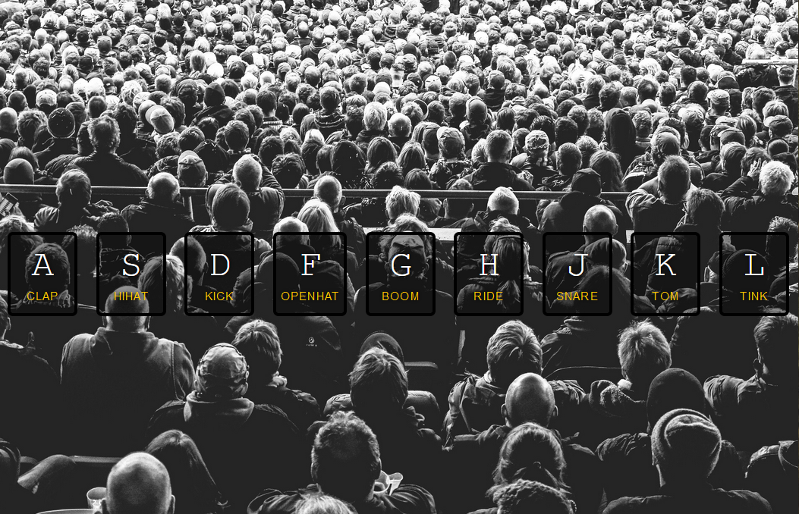

# JS-Drum-Kit

JavaScript Drum Kit App

<!-- Live link to deployed app -->

Repository: https://github.com/Mdudzik92/JS-Drum-Kit 
Deployed app: https://mdudzik92.github.io/JS-Drum-Kit/

<!-- Technologies used -->

HTML, CSS, JavaScript, Audio

<!-- Explanation of what the app is -->

This is a simple vanilla JavaScript app in which the user can instantiate drum kit sounds as key events by simply pressing the keys on the screen. It plays the audio file associated with the key, listens for a transition in order to highlight and slightly increase the size of the letter that was keyed by the user, then removes the transition.

<!-- Screenshot -->

<!-- License -->

MIT

<!-- Contact information -->

Email: mdudzik92@gmail.com
